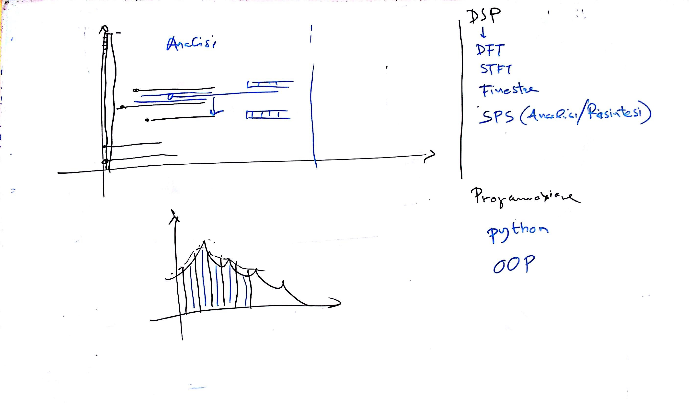

# Lezione del 3 novembre 2016

## Cose fatte

* programmazione del progetto dell'A.A. 2016-2017
  * realizzazione di *macro-fusioni* spettrali:
    * analisi/risintesi ricombinate
    * ripasso di: DFT, STFT, Finestre, Rilevamento dei picchi spettrali, Signal-Plus-Noise
    * SMS tools
