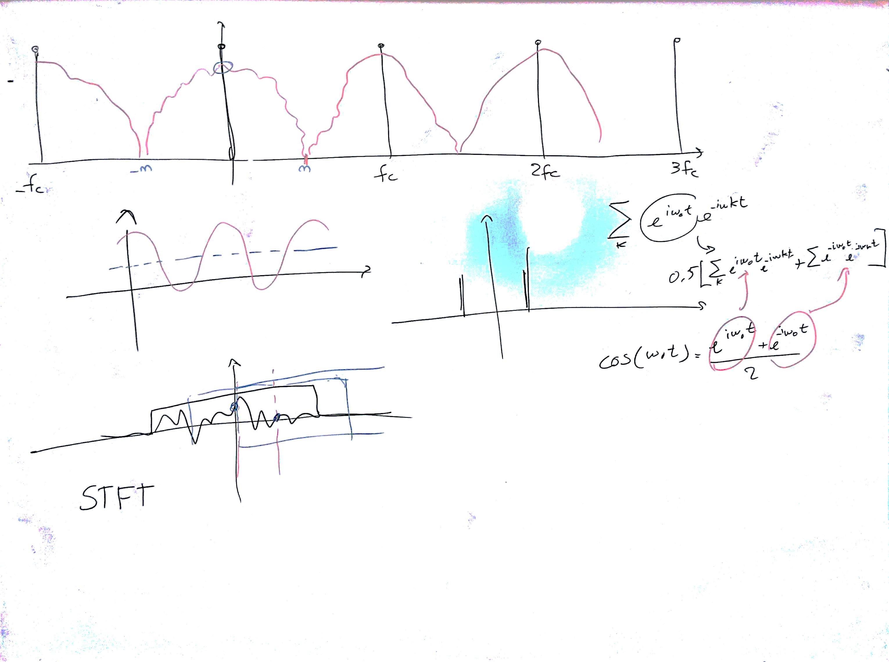

# Lezione del 2 febbraio 2017 (ENSM)

## Argomenti

* ripasso del campionamento letto secondo il paradigma della modulazione d'ampiezza
  * implicazioni spettrali
* introduzione alla *Short-time Fourier Transform*
  * parametri fondamentali (*window size*, *hop size*)
  * revisione del *trade-off* tempo/frequenza
