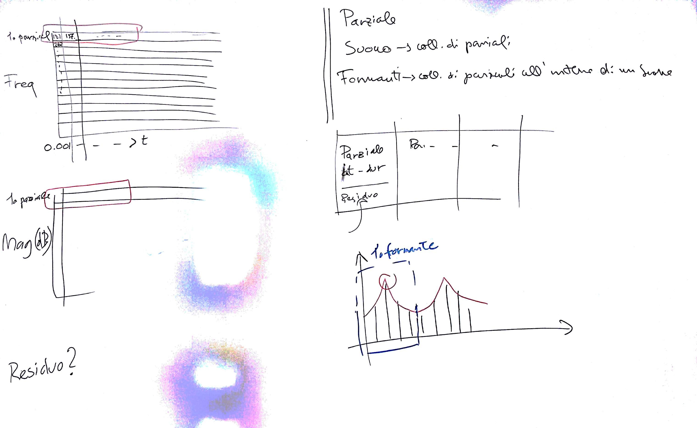

# Lezione del 21 aprile 2017 (ENSM)

## Argomenti

* Elaborazione dell'`output` intermedio della fase di analisi HPS:
   * strutturazione orientata agli oggetti:
     * Oggetto `Parziale` con una sequenza di `frames`, un `action time`, una `durata`
     * Oggetto `Suono` come collezione di parziali congruenti
     * Oggetto `Formante` come collezione parziale di parziali congruenti (tra
       due minimi dell'inviluppo spettrale)
