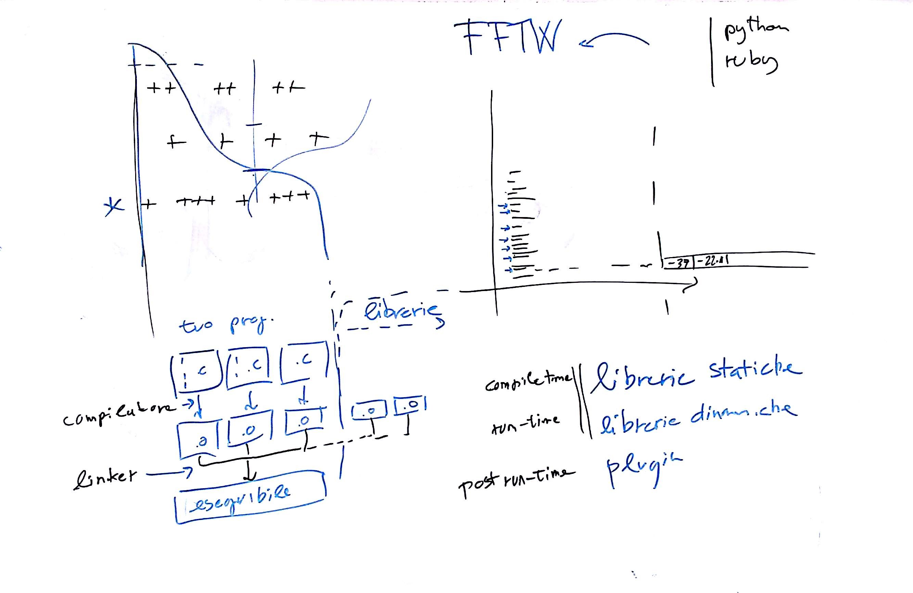

# Lezione del 4 novembre 2016

## Cose fatte

* programmazione del progetto dell'A.A. 2016-2017
  * programmazione di *fusioni spettrali*:
    * linguaggi di scripting: *python*, *ruby*
    * ripasso dei concetti di libreria:
      * librerie statiche
      * librerie dinamiche
      * plugin
