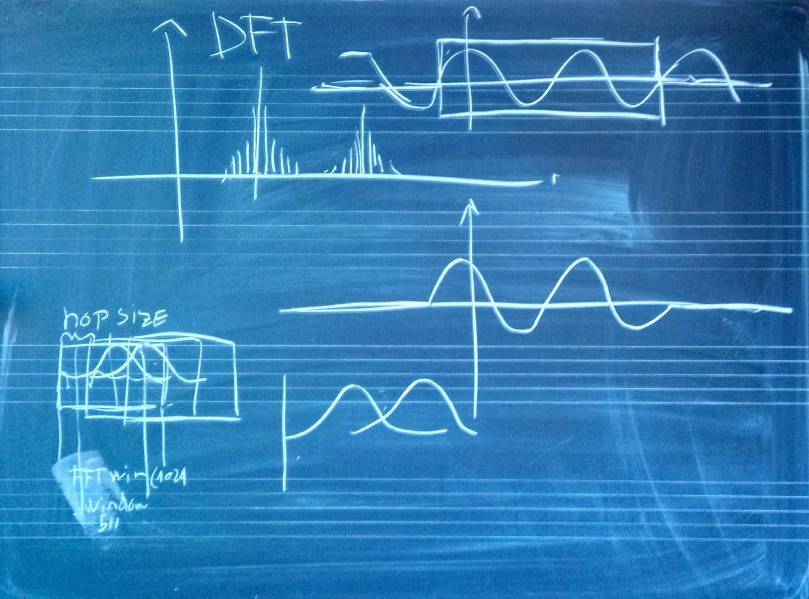

# Lezione del 16 dicembre 2016 (Programmazione)

## Cose fatte

* installazione e messa in funzione di SMS-tools
* illustrazione delle principali funzioni:
  * DFT
  * STFT
  * SPS
  * SPR
* impatto dei parametri
* scelta delle finestre e impatto
* ascolto della componente sinusoidale pura
* ascolto della componente residua
