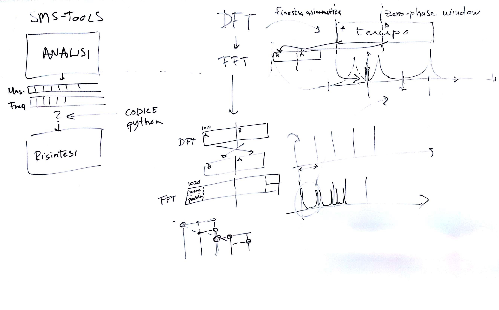
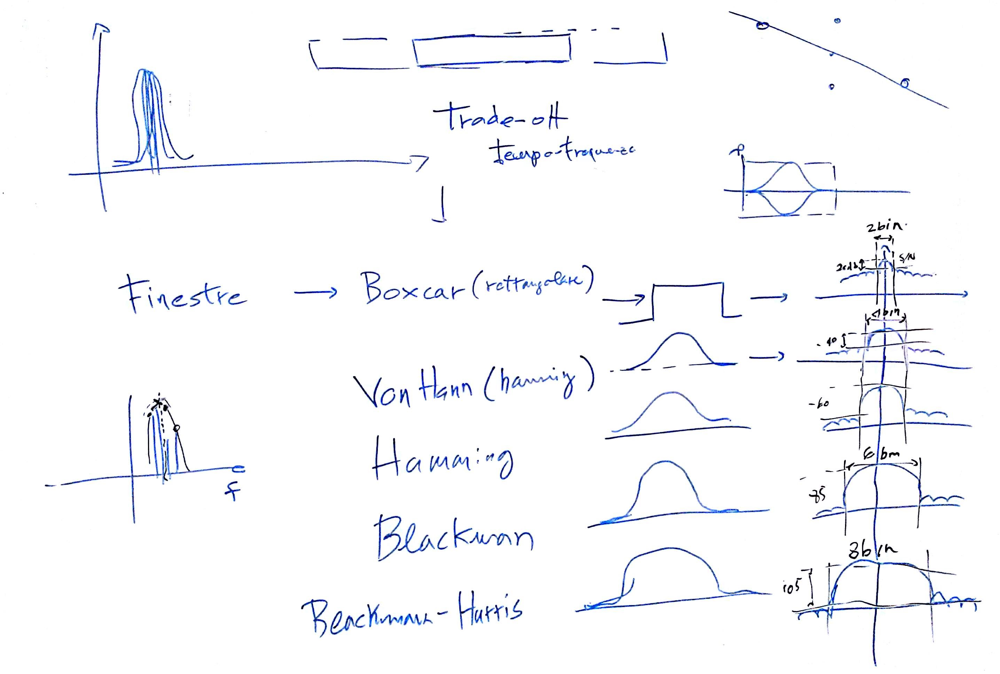
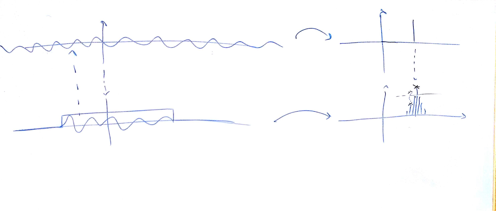

# Lezione del 20 gennaio 2016 (Programmazione)

## Argomenti trattati

* approfondimento DFT x SMS-tools
  * *zero-phase windowing* (inversione destra-sinistra)
  * zero-padding (interpolazione spettrale)
* trade-off risoluzione spaziale/temporale
* caratteristiche dei vari tipi di finestre
  * risoluzione frequenziale
  * rumore di fondo dei *side-lobes*
