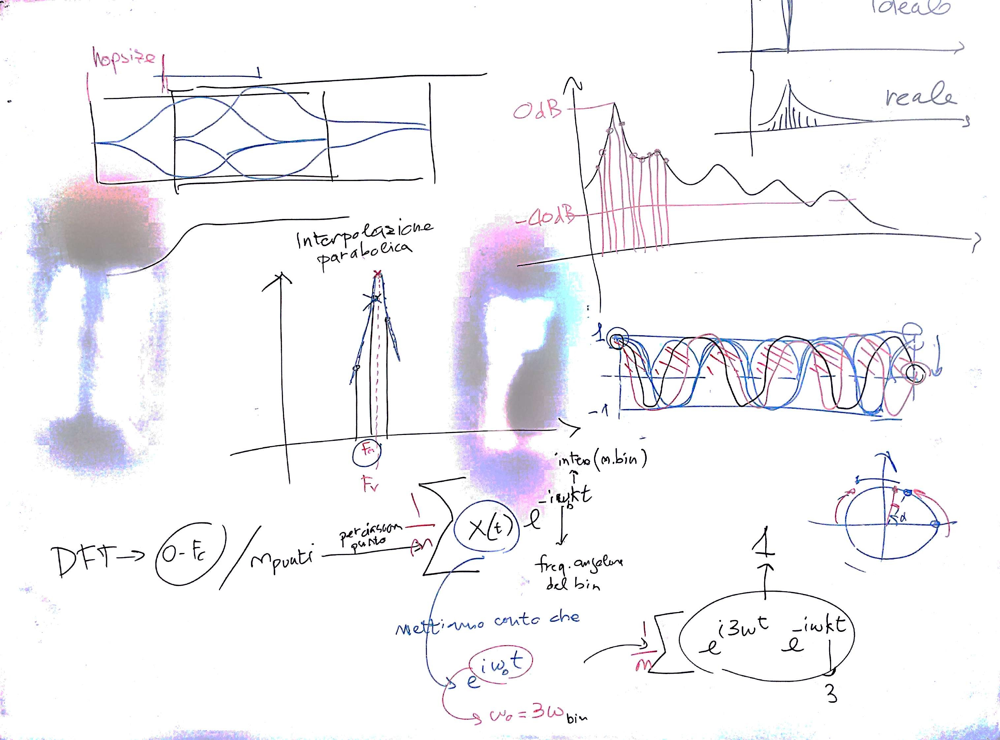

# Lezione del 3 febbraio 2017 (Programmazione)

## Argomenti trattati

* approfondimento della *Short-time Fourier Transform*
* rilevamento della frequenza
  * sistema "Serra": frequenza nominale del bin + interpolazione parabolica dei tre bin contigui
  * sistema "phase vocoder": rilevamento in base alla differenza di fase
