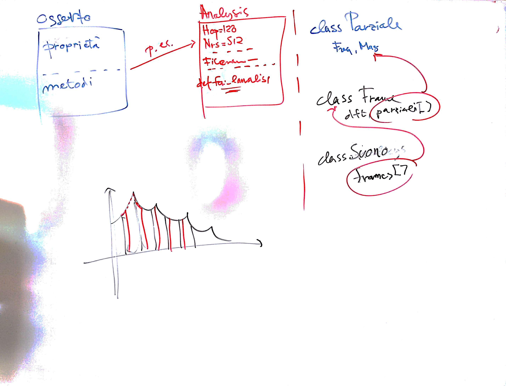

# Lezione del 24 marzo 2017 (Programmazione)

## Argomenti trattati

* Elaborazione della libreria software
  [`Volto`](https://github.com/demartinomrc/Volto)
* elaborazioni delle classi e dei test relativi
